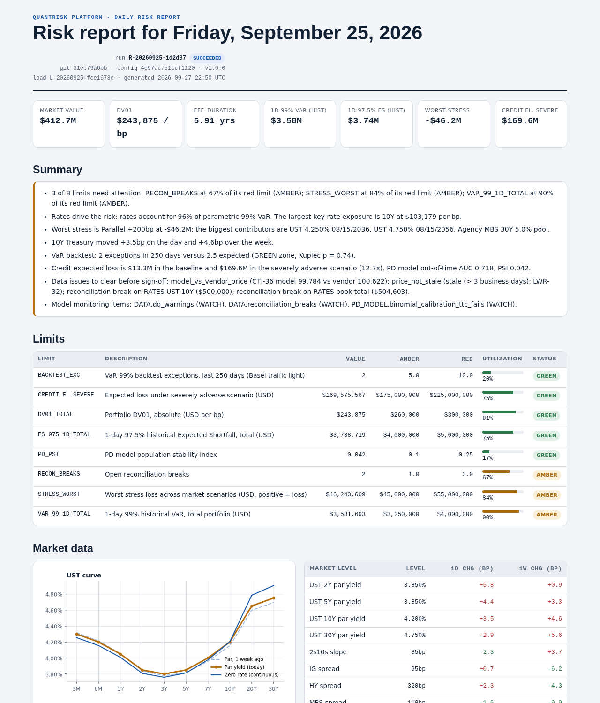
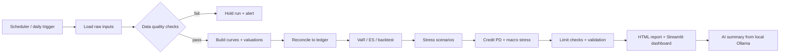
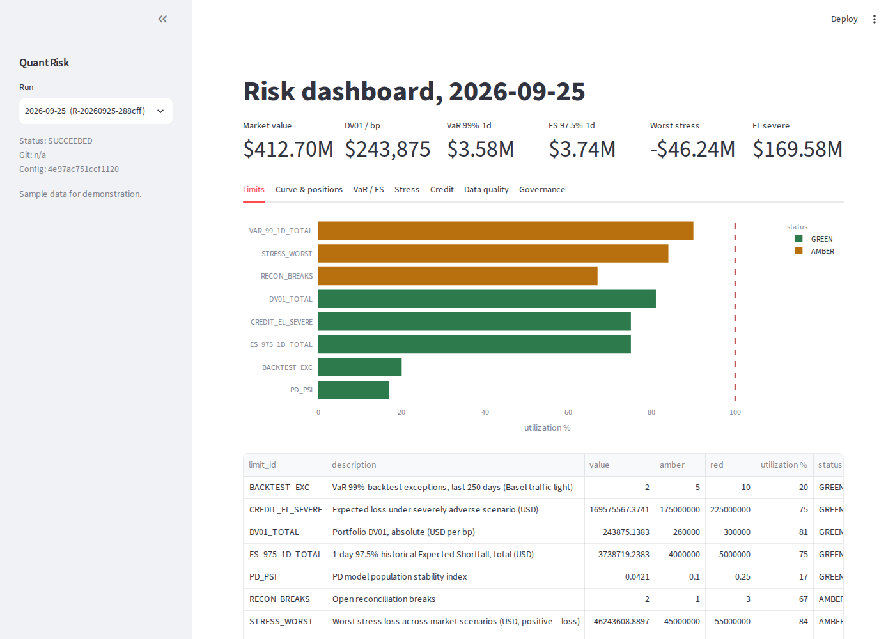

# QuantRisk

<div align="center">
  
</div>

<p align="center">
  <strong>An interactive fixed-income and credit-risk analytics prototype for portfolio risk review.</strong>
</p>

<p align="center">
  
  
  
  
</p>

QuantRisk is a Python analytics application with a batch calculation pipeline, persisted run results, an HTML report, and a Streamlit dashboard. The repository includes sample inputs for exploration and a limited FRED connector for Treasury curve and macro data. The sample path is not live portfolio data, and the FRED connector does not replace an asset manager's market-data, holdings, or pricing feeds.

The dashboard reads completed results from a database. It refreshes its view every minute and can follow newly completed runs, but a separate scheduled process must ingest inputs and calculate those runs. It is not a continuous market-data feed or a validated production risk service.

---

## Why it matters

The first intended users are asset-management portfolio risk teams reviewing fixed-income exposures. The current code is an early product foundation that needs validation against real holdings, pricing, benchmarks, policies, and independent expected results before it can support investment or control decisions.

The real value is in how it translates market moves into decisions:

- portfolio exposures become risk-adjusted numbers
- curve changes become DV01 and duration effects
- scenario shocks become loss estimates and control alerts
- model governance becomes a daily operating routine
- AI adds a plain-English summary without sending data outside the environment

In other words, the system helps a risk desk answer the questions that matter every morning:

- What changed since yesterday?
- Where are the losses concentrated?
- Which positions are approaching limits?
- Which scenarios are driving the risk?
- Is the portfolio still within policy?

---

## What the dashboard is built to do

The dashboard supports review of saved portfolio-risk calculations.

It helps a user quickly see:

- market value and P&L context
- VaR and Expected Shortfall by horizon
- stress losses and scenario drivers
- credit loss outlook under adverse conditions
- governance state, validation results and limit utilization
- operational data freshness and health checks
- a guided portfolio-review tab to capture a mandate, inspect readiness and risk checks, compare saved runs, and export a human-review draft

This combines analytics, controls, and monitoring into a single operational surface.

---

## Current data behavior

- `--with-sample` creates synthetic portfolio and market inputs for a repeatable demonstration.
- Demo and portfolio results use separate databases, landing folders, and report folders. The dashboard sidebar switches between `Demo / sample` and `Portfolio feeds`.
- A portfolio-profile run uses FRED for Treasury curves and macro series and requires real portfolio/vendor CSVs for the remaining feeds. It does not fill missing feeds with generated samples.
- The dashboard displays persisted results. It does not start a batch job or poll a market-data vendor.
- A shared deployment needs a continuously available database and separate input-ingestion and risk-run scheduling. Netlify static hosting cannot run the Streamlit Python server.

---

## Example calculation workflow



---

## Highlights

| Capability | What it does |
|---|---|
| Market data ingestion | Reads landing files for curves, prices, spreads, vols, positions, ledger, macro and obligor data |
| Fixed-income analytics | Bootstrap curves, price bonds, calculate DV01, duration, convexity and key-rate risk |
| Risk engine | Historical, parametric and Monte Carlo VaR / ES with backtesting |
| Stress testing | Parallel, steepener, spread, volatility and combined recession scenarios |
| Credit module | PD scorecard, expected loss, calibration and macro stress |
| Governance | Validation tests, limits, alerts and operational health checks |
| Reporting | HTML report and interactive Streamlit dashboard |
| AI summary | Private local summarization via Ollama |

---

## Intended first pilot

Work with one asset manager's fixed-income risk team to validate an end-of-day workflow: ingest an agreed holdings and market-data snapshot, reconcile positions and valuation, review DV01/VaR/stress results against its existing controls, and compare outputs to its incumbent process. Define tolerances and sign-off owners before use in decision-making. No performance or risk-control improvement is claimed until measured with that team.

---

## Quick start

```powershell
cd C:\Users\garde\Desktop\quantrisk
py -3.11 -m venv .venv
.\.venv\Scripts\Activate.ps1
python -m pip install -e ".[dashboard]"
python -m quantrisk.cli --profile demo run --as-of today --with-sample
python -m streamlit run dashboards/app.py
```

### Run the interactive dashboard

Run these commands from the repository root in PowerShell. A relative `.venv` path fails if the terminal is still in `C:\Users\garde`:

```powershell
cd C:\Users\garde\Desktop\quantrisk
.\.venv\Scripts\Activate.ps1
streamlit run dashboards/app.py
```

Open the local URL printed by Streamlit (usually `http://localhost:8501`). If `.venv` does not exist, run the environment creation and install commands in Quick start. If PowerShell blocks activation, use `Set-ExecutionPolicy -Scope Process Bypass` for that terminal, then activate. The dashboard reads saved runs from `QR_DATABASE_URL`; the default is `data/quantrisk.db`. To add a run while the app is open, run the CLI command in a second terminal. With “Follow latest successful run” enabled, the dashboard displays it after its next refresh.

### Host the interactive app

The dashboard is a Python Streamlit server, so it must run on a Streamlit or container hosting service; Netlify static hosting cannot run this app. For Streamlit Community Cloud, create an app from this repository, choose branch `main` and entry point `dashboards/app.py`, then provide `QR_DATABASE_URL` in the app's Secrets settings. The local SQLite database and raw files are not included in Git, so a cloud deployment needs a database reachable from the app and a separate scheduled risk run that writes to it. Do not place real portfolio data in the public repository.

### Data and scheduled runs

The sample command above writes synthetic results only to the demo profile. To calculate a separate portfolio result, set `FRED_API_KEY`, place the seven approved CSV feeds below in a folder, then run:

```powershell
python -m quantrisk.cli --profile portfolio run --as-of today `
  --with-real-data --portfolio-input-dir C:\path\to\approved-csvs
```

Required files and columns (additional vendor columns are allowed):

| File | Required columns |
|---|---|
| `instruments.csv` | `instrument_id, asset_class, coupon, issue_date, maturity_date, frequency, day_count` |
| `spreads.csv` | `spread_index, as_of_date, spread_bp, source` |
| `vols.csv` | `vol_index, as_of_date, normal_vol_bp, source` |
| `prices.csv` | `instrument_id, as_of_date, source, clean_price, price_date` |
| `positions.csv` | `book_id, instrument_id, as_of_date, face_amount, source_system` |
| `ledger.csv` | `book_id, instrument_id, as_of_date, face_amount, market_value` |
| `obligors.csv` | `obligor_id, year, leverage, interest_coverage, roa, current_ratio, log_assets` |

The selected `--as-of` date must be covered by the portfolio feeds. Historical prices and market factors should cover the desired VaR and backtest lookbacks; a single-day extract cannot support a meaningful historical risk history. The process fetches FRED inputs into the isolated portfolio landing folder, then validates and calculates the run. It requires network access to FRED and a configured API key. No vendor feed or real portfolio files are included in this repository.

For continuous viewing across users, host Streamlit and a shared database; for continuous updating, schedule ingestion and calculation separately. The portfolio `live`/`daily` shortcuts are disabled until they accept an explicit approved input feed, to prevent sample holdings from entering the portfolio results set.

### Local AI summary

```bash
ollama serve
ollama pull llama3.2
quantrisk ai --prompt "Summarize the daily risk posture in plain English."
```

> For a future controlled pilot, configure:
> - FRED API key for live curve/macro inputs
> - Ollama local model for AI summary
> - Windows Task Scheduler or a scheduled job to trigger run_daily.ps1

---

## Risk report and dashboard

| Risk report | Streamlit dashboard |
|---|---|
|  |  |

The screenshots show interface examples; they are not evidence of live connected data or production validation.

---

## What the platform produces

| Measure | Example output |
|---|---|
| Market value | $412.7M |
| 1-day 99% VaR | ~$3.6M |
| 1-day 97.5% ES | ~$3.7M |
| Worst stress | Parallel +200bp: -$46.2M |
| Credit expected loss | Baseline / adverse / severe |
| Limits | Green, amber and red control checks |

---

## Architecture overview

### Core layers

| Layer | Description | Location |
|---|---|---|
| Ingestion | Landing files, validations, FRED imports, data quality checks | `src/quantrisk/ingest/` |
| Fixed income | Yield curves, bonds, valuations, KRD and DV01 | `src/quantrisk/fixed_income/` |
| Risk | VaR, ES, backtest and stress logic | `src/quantrisk/risk/` |
| Credit | PD scoring, calibration, expected loss | `src/quantrisk/credit/` |
| Governance | Limits, validation, model inventory | `src/quantrisk/governance/` |
| Reporting | HTML report and dashboard output | `src/quantrisk/reporting/`, `dashboards/` |
| Operations | Daily cycle, health checks and alerts | `src/quantrisk/daily.py`, `src/quantrisk/ops.py` |

---

## Repository layout

```text
config/                     configuration and scenarios
src/quantrisk/
  ingest/                   sample_data, live sources, DQ rules
  data/                     schema, db, reconciliation
  fixed_income/             curves, bonds, KRD, portfolio
  risk/                     VaR, backtest, factors
  stress/                   stress engine
  credit/                   PD, calibration, macro stress
  governance/               limits and validation
  reporting/                report generation and template
  pipeline.py               daily batch orchestration
  cli.py                    command-line entry point
  ai/                       local Ollama integration
  daily.py                  production daily wrapper
  ops.py                    operational health checks
  alerts.py                 alert payloads

dashboards/app.py           Streamlit dashboard
sql/migrations/            schema and reporting views
tests/                     automated validation suite
infra/                     cloud deployment scaffolding
```

---

## Design principles

- One revaluation path for all methods
- Persisted results instead of recomputation
- Audit trail for every run
- Explicit limit and validation controls
- Local AI keeps the summary private and operationally safe

---

## Tools and stack

- Python 3.11+
- pandas / numpy / scipy / scikit-learn
- SQLAlchemy + SQLite / PostgreSQL
- Plotly + Streamlit
- Jinja2 reporting templates
- Ollama for local AI summaries
- Docker and Terraform support for deployment

---

## Production notes

QuantRisk is an early-stage prototype. Production readiness still requires real and licensed portfolio data integrations, deployment and access controls, monitoring and alert delivery, recovery procedures, independent model validation, reconciliation against an incumbent system, and an agreed asset-manager pilot.

---

## License

Copyright (c) 2026 Garde. All rights reserved.

This project and all associated source code, documentation, and design materials are the exclusive property of Garde. No part of this repository may be reproduced, distributed, or used in any form without prior written permission.

Built as a starting point for validated portfolio-risk workflows.
