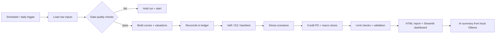

# QuantRisk

<div align="center">
  
</div>

<p align="center">
  <strong>Operational fixed-income, market-risk, and credit-risk analytics for a live daily risk process.</strong>
</p>

<p align="center">
  
  
  
  
</p>

QuantRisk is designed to behave like a real treasury or risk operating desk: it ingests market data, validates it, prices bonds, measures exposure, runs stress and credit scenarios, checks limits, and publishes a risk report the same way a daily production workflow would.

Every result is tied back to its code version, config hash, and input data lineage so the process remains reviewable and auditable.

---

## Why it matters

This is not a demo. It is a business-facing risk operating system for a modern finance team.

The real value is in how it translates market moves into decisions:

- portfolio exposures become risk-adjusted numbers
- curve changes become DV01 and duration effects
- scenario shocks become loss estimates and control alerts
- model governance becomes a daily operating routine
- AI adds a plain-English summary without sending data outside the environment

In other words, the system helps a risk desk answer the questions that matter every morning:

- What changed since yesterday?
- Where are the losses concentrated?
- Which positions are approaching limits?
- Which scenarios are driving the risk?
- Is the portfolio still within policy?

---

## What the dashboard is built to do

The dashboard is meant to look and behave like a real risk command center.

It helps a user quickly see:

- market value and P&L context
- VaR and Expected Shortfall by horizon
- stress losses and scenario drivers
- credit loss outlook under adverse conditions
- governance state, validation results and limit utilization
- operational data freshness and health checks

This combines analytics, controls, and monitoring into a single operational surface.

---

## Why this exists

A risk platform is only useful when it is operational, not just demonstrative.

QuantRisk combines four things that matter in production:

- live market inputs and portfolio data
- deterministic risk calculations
- automated governance and limits
- a fast review layer with dashboard and report outputs

This is the same pattern used in a daily risk-control workflow: validate, price, measure, stress, govern, and summarize.

---

## Live operational workflow



---

## Highlights

| Capability | What it does |
|---|---|
| Market data ingestion | Reads landing files for curves, prices, spreads, vols, positions, ledger, macro and obligor data |
| Fixed-income analytics | Bootstrap curves, price bonds, calculate DV01, duration, convexity and key-rate risk |
| Risk engine | Historical, parametric and Monte Carlo VaR / ES with backtesting |
| Stress testing | Parallel, steepener, spread, volatility and combined recession scenarios |
| Credit module | PD scorecard, expected loss, calibration and macro stress |
| Governance | Validation tests, limits, alerts and operational health checks |
| Reporting | HTML report and interactive Streamlit dashboard |
| AI summary | Private local summarization via Ollama |

---

## Executive summary

QuantRisk is a full-stack risk platform designed for daily operational use across a fixed-income and credit portfolio.

It gives a finance team the ability to:

- ingest and validate market data every business day
- run deterministic risk calculations on a real portfolio
- assess losses under stressed scenarios
- monitor governance and limit utilization
- generate an audit-friendly HTML report
- review the situation in a clear dashboard interface
- add private AI guidance from a local model

This is the practical foundation for a real production risk workflow rather than a static proof of concept.

---

## Quick start

```bash
pip install -e ".[dev,dashboard]"
quantrisk --plain-logs run --as-of 2026-09-25 --with-sample
streamlit run dashboards/app.py
```

### Daily production run

```powershell
# PowerShell
$env:FRED_API_KEY = "your_fred_api_key"
python -m quantrisk.cli daily --as-of 2026-09-25 --no-ai
```

### Local AI summary

```bash
ollama serve
ollama pull llama3.2
quantrisk ai --prompt "Summarize the daily risk posture in plain English."
```

> For a real daily production workflow, use:
> - FRED API key for live curve/macro inputs
> - Ollama local model for AI summary
> - Windows Task Scheduler or a scheduled job to trigger run_daily.ps1

---

## Risk report and dashboard

| Risk report | Streamlit dashboard |
|---|---|
|  |  |

This gives you both an audit-grade report and a live operational review layer in one system.

---

## What the platform produces

| Measure | Example output |
|---|---|
| Market value | $412.7M |
| 1-day 99% VaR | ~$3.6M |
| 1-day 97.5% ES | ~$3.7M |
| Worst stress | Parallel +200bp: -$46.2M |
| Credit expected loss | Baseline / adverse / severe |
| Limits | Green, amber and red control checks |

---

## Architecture overview

### Core layers

| Layer | Description | Location |
|---|---|---|
| Ingestion | Landing files, validations, FRED imports, data quality checks | `src/quantrisk/ingest/` |
| Fixed income | Yield curves, bonds, valuations, KRD and DV01 | `src/quantrisk/fixed_income/` |
| Risk | VaR, ES, backtest and stress logic | `src/quantrisk/risk/` |
| Credit | PD scoring, calibration, expected loss | `src/quantrisk/credit/` |
| Governance | Limits, validation, model inventory | `src/quantrisk/governance/` |
| Reporting | HTML report and dashboard output | `src/quantrisk/reporting/`, `dashboards/` |
| Operations | Daily cycle, health checks and alerts | `src/quantrisk/daily.py`, `src/quantrisk/ops.py` |

---

## Repository layout

```text
config/                     configuration and scenarios
src/quantrisk/
  ingest/                   sample_data, live sources, DQ rules
  data/                     schema, db, reconciliation
  fixed_income/             curves, bonds, KRD, portfolio
  risk/                     VaR, backtest, factors
  stress/                   stress engine
  credit/                   PD, calibration, macro stress
  governance/               limits and validation
  reporting/                report generation and template
  pipeline.py               daily batch orchestration
  cli.py                    command-line entry point
  ai/                       local Ollama integration
  daily.py                  production daily wrapper
  ops.py                    operational health checks
  alerts.py                 alert payloads

dashboards/app.py           Streamlit dashboard
sql/migrations/            schema and reporting views
tests/                     automated validation suite
infra/                     cloud deployment scaffolding
```

---

## Design principles

- One revaluation path for all methods
- Persisted results instead of recomputation
- Audit trail for every run
- Explicit limit and validation controls
- Local AI keeps the summary private and operationally safe

---

## Tools and stack

- Python 3.11+
- pandas / numpy / scipy / scikit-learn
- SQLAlchemy + SQLite / PostgreSQL
- Plotly + Streamlit
- Jinja2 reporting templates
- Ollama for local AI summaries
- Docker and Terraform support for deployment

---

## Production notes

The project is built to support a realistic daily workflow, but live market data still depends on external inputs such as a FRED API key. The same operational logic works equally well on a local workstation, a VM, or a scheduled production environment.

---

## License

Copyright (c) 2026 Garde. All rights reserved.

This project and all associated source code, documentation, and design materials are the exclusive property of Garde. No part of this repository may be reproduced, distributed, or used in any form without prior written permission.

Built for operational risk review, not just demo presentation.
