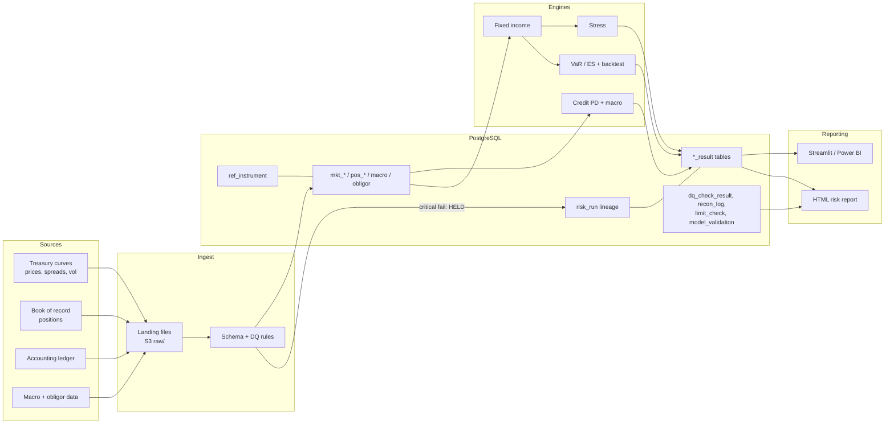

# Architecture

## Runtime (AWS)

| Step | Service |
|---|---|
| Trigger at 17:30 America/Chicago, Monday to Friday | EventBridge Scheduler, 2 retries |
| Run the batch | ECS Fargate task, 2 vCPU / 8 GB, image tagged with git SHA from ECR |
| Secrets | Secrets Manager (database URL), injected as env var by the execution role |
| Storage | RDS PostgreSQL 16 (encrypted, 14-day backups); S3 for raw landing, curated data and reports (versioned, KMS, public access blocked, raw/ to Glacier IR after 90 days) |
| Logs | CloudWatch Logs, JSON lines with `run_id`, 400-day retention |
| Alerts | Metric filters on "run failed", "run held on data quality" and "run succeeded"; alarms for failure and for a missing success in 24h, sent to an SNS email |

Terraform lives in `infra/terraform/aws`. The Azure equivalent is in `infra/azure/README.md`.

## Scaling path

The batch runs in about 7 seconds for 14 positions and 3,000 obligors. Monte Carlo is the cost driver (paths x instruments x cash flows). To scale up:

1. Vectorize across instruments with padded cash-flow matrices.
2. Shard Monte Carlo by book across Fargate tasks.
3. Move the step graph to Prefect or Airflow once books run on different schedules.
4. Store factor history and P&L vectors as Parquet on S3, and keep Postgres for results and controls.
